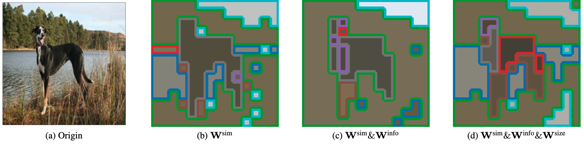

# MCTF

[](https://paperswithcode.com/sota/efficient-vits-on-imagenet-1k-with-deit-s?p=multi-criteria-token-fusion-with-one-step)  
[](https://paperswithcode.com/sota/efficient-vits-on-imagenet-1k-with-deit-t?p=multi-criteria-token-fusion-with-one-step)  
[](https://paperswithcode.com/sota/efficient-vits-on-imagenet-1k-with-lv-vit-s?p=multi-criteria-token-fusion-with-one-step)  

Official implementation of CVPR 2024 paper "[Multi-criteria Token Fusion with One-step-ahead Attention for Efficient Vision Transformers](https://arxiv.org/abs/2403.10030)".



## 1. Setup 
1. Clone repository
```
git clone https://github.com/mlvlab/MCTF.git
cd MCTF
```

2. Setup conda environment
```
conda env create --file env.yaml
conda activate mctf
```

# Run Experiments
## Finetuning
```
python -m torch.distributed.launch --nproc_per_node=8 --use_env main.py --data_path /path/to/imagenet --dataset IMNET --output_dir ./output --batch-size 128 --min_lr_times 0.1 --lr_times 0.03 --epochs 30 --activate_layer [1,2,3,4,5,6,7,8,9,10,11] --model deit_small --use_mctf True --mctf_type [16,8,0,1,1,1,20,40,1,1,0] --task_type [1,1,0.4] --task_weight [1.0,1.0,3.0] 
```

## Evaluation
To evaluate a pre-trained `MCTF (DeiT-S)` model on ImageNet val with a single GPU run:
```
python main.py --eval --data_path /path/to/imagenet --dataset IMNET --resume /path/to/checkpoint/ --use_mctf True --mctf_type [16,0,0,1,1,1,20,40,1,1,0] --task_type [1,0,0,0] --r_evals [16] --activate_layer [1,2,3,4,5,6,7,8,9,10,11] --model deit_small
```

## Model Zoo
Flops and Throughput are measured with single RTX 3090.
MCTF-Fast is advanced version of MCTF that boost the throughput while keeping the accuracy and FLOPs by changing the drop ratio per layer.


|   Baseline Model   | Top 1 Accuracy | GFLOPs | Throughput |                  script                  |                                         Checkpoint                                          |
|:------------------:|:--------------:|:------:|:----------:|:----------------------------------------:|:-------------------------------------------------------------------------------------------:|
|       DeiT-T       |      72.2      |  1.26  |     -      |                    -                     |                                              -                                              |
|   MCTF (DeiT-T)    |      72.7      |  0.71  |    4639    |   [script](./run/eval_deit_t_mctf.sh)    | [drive](https://drive.google.com/file/d/1Q9yQ2-oof39fVHTKQtffmn1p-8pcgaDI/view?usp=sharing) |
| MCTF-Fast (DeiT-T) |      72.7      |  0.75  |    7386    | [script](./run/eval_deit_t_mctf_fast.sh) | [drive](https://drive.google.com/file/d/1Q9yQ2-oof39fVHTKQtffmn1p-8pcgaDI/view?usp=sharing) | 
|       DeiT-S       |      79.8      |  4.61  |     -      |                    -                     |                                              -                                              | 
|   MCTF (DeiT-S)    |      80.1      |  2.60  |    2302    |   [script](./run/eval_deit_s_mctf.sh)    | [drive](https://drive.google.com/file/d/12MAgOFGYX9RmyA7TOkMvL2a01zX7NieM/view?usp=sharing) |
| MCTF-Fast (DeiT-S) |      80.1      |  2.76  |    3302    | [script](./run/eval_deit_s_mctf_fast.sh) | [drive](https://drive.google.com/file/d/12MAgOFGYX9RmyA7TOkMvL2a01zX7NieM/view?usp=sharing) |


## Citation
```
@inproceedings{lee2024multi,
  title={Multi-criteria Token Fusion with One-step-ahead Attention for Efficient Vision Transformers},
  author={Lee, Sanghyeok and Choi, Joonmyung and Kim, Hyunwoo J.},
  booktitle={Conference on Computer Vision and Pattern Recognition},
  year={2024}
}
```
